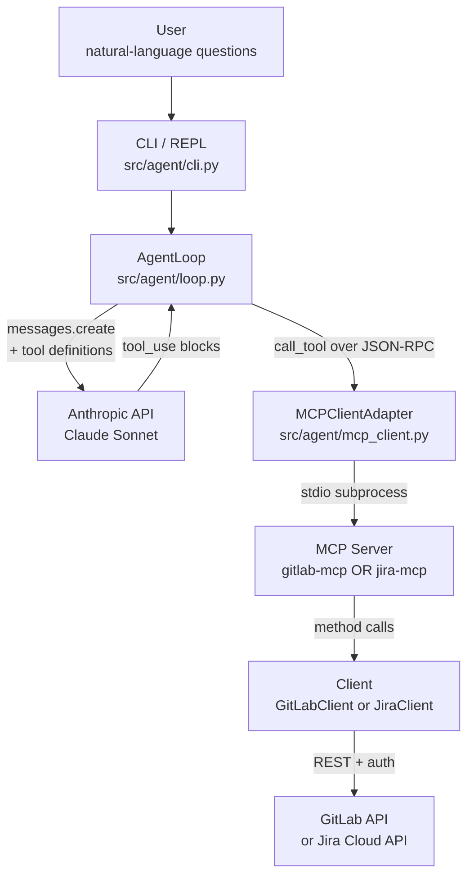

# gitlab-mcp

[](https://github.com/readyrok/gitlab-mcp/actions/workflows/ci.yml)

> Two read-only [Model Context Protocol](https://modelcontextprotocol.io/)
> servers — one for GitLab, one for Jira — plus a CLI agent that drives them
> through the Anthropic API. The agent has zero backend knowledge; swap the
> MCP server, same loop.

Built as a study project to understand MCP from both sides — the protocol's
server surface (how tools are described and executed) and its client surface
(how an agent discovers and orchestrates them). The whole stack runs locally
against your own credentials.

[](https://asciinema.org/a/Y9f1T7hIbrZSNWp9)

## Why this exists

Modern engineering organizations are starting to deploy AI agents that act on
real systems — GitLab, Jira, internal services, CI tooling. MCP is the
emerging standard for how an agent discovers and uses such tools, and it's
the same protocol Claude Desktop, Cursor, and other production clients use.

This project demonstrates the full stack:

- **Two real MCP servers** — GitLab (5 tools) and Jira (2 tools) — exposing
  developer-platform capabilities with LLM-facing tool descriptions tuned
  for accuracy.
- **A real MCP client + agentic loop** that uses the Anthropic API to drive
  either server. Streams tool calls live so you can watch the agent reason.
- **A behavioral eval suite** (20 scenarios across both connectors) that
  exercises the agent end-to-end against real APIs — catching things mocked
  unit tests can't, like the GitLab tool description that let Claude guess
  `project_id=0` until I tightened it, or the Jira `/rest/api/3/search`
  endpoint Atlassian fully removed mid-build.
- **The lifecycle around it**: TDD on both clients, server-level integration
  tests, structured logging at API boundaries, bounded outputs for LLM
  consumption, typed exception hierarchies with single-point translation,
  per-question token + latency observability.

The detailed reasoning behind every architectural choice — and what would
change at scale — lives in [`docs/DESIGN.md`](docs/DESIGN.md).

## Architecture



Three things worth noting about the layout:

- **The agent has no backend knowledge.** It speaks MCP. The same loop drives
  the GitLab server one moment and the Jira server the next — just change
  `--server-command`.
- **Each MCP server has no agent knowledge.** It exposes tools. Any
  MCP-compatible client (Claude Desktop, Cursor, your own agent) can use it.
- **The boundary between agent and server is a real subprocess speaking
  JSON-RPC over stdio.** It's not a glorified function call dressed up as a
  protocol — same transport Claude Desktop uses against MCP servers in
  production.

## Tools exposed

### GitLab connector (`gitlab-mcp`)

Each tool's full LLM-facing description lives in
[`src/gitlab_mcp/server.py`](src/gitlab_mcp/server.py); these are the
one-line summaries.

| Tool | Purpose |
|---|---|
| `list_projects` | Enumerate projects accessible to the configured user |
| `get_merge_requests` | List MRs by project and state (opened / closed / merged / locked / all) |
| `search_issues` | Find issues by free-text search within a project |
| `get_pipeline_status` | Most recent CI pipelines for a project, newest-first |
| `get_user_activity` | Aggregated summary of a user's recent commits / MRs / issues / comments |

### Jira connector (`jira-mcp`)

Sibling package to `gitlab_mcp` — proves the architecture generalizes. Two
tools, deliberately minimal: the point is to show that a new backend is a
new package plus a console-script entry, with the agent untouched.

| Tool | Purpose |
|---|---|
| `list_projects` | Enumerate Jira projects accessible to the configured account |
| `search_issues` | Find issues in a project by keyword (builds JQL under the hood) |

See [`docs/DESIGN.md`](docs/DESIGN.md) §12 for the architectural reasoning
(parallel packages vs. shared base, one config layer for N connectors, the
Jira security-model difference, and a real endpoint-deprecation bug the live
integration caught).

## Quickstart

Requires Python 3.11+, [uv](https://docs.astral.sh/uv/), and at minimum a
GitLab account. Jira is optional — only needed to run the second connector.

```bash
# 1. Install dependencies
uv sync --all-extras

# 2. Configure
cp .env.example .env
# Edit .env: set GITLAB_TOKEN (read_api scope is enough) and ANTHROPIC_API_KEY.
# Optionally add JIRA_URL / JIRA_EMAIL / JIRA_TOKEN to enable the Jira connector.

# 3. (Optional) Seed demo workspaces
uv run python scripts/seed_gitlab.py --seed   # 3 projects, ~22 issues, MRs, pipelines
uv run python scripts/seed_jira.py --seed     # 3 projects, ~16 issues

# 4. Run the agent — GitLab by default
uv run agent                              # interactive REPL
uv run agent "what's broken in CI?"       # single-shot
uv run agent --verbose "..."              # show every tool call as it happens

# 5. Run the agent against Jira — same agent, different server
uv run agent --server-command "uv run jira-mcp" "find login bugs in the mobile project"

# 6. Or run an MCP server directly (e.g. for Claude Desktop, Cursor, the MCP Inspector)
uv run gitlab-mcp
uv run jira-mcp
```

Full setup details — including the two-token GitLab security model and Jira
Cloud account / API token steps — are in [`docs/SETUP.md`](docs/SETUP.md).

## Running the server in Docker

A `Dockerfile` and `compose.yml` are included so you can run the GitLab MCP
server in a container — useful when wiring it into Claude Desktop, Cursor,
or another MCP client that prefers a stable subprocess target.

```bash
docker compose build
docker compose run --rm server
```

The image is multi-stage (uv-based builder, slim runtime) and runs as a
non-root user. The agent itself isn't containerized — it spawns the server
as a local subprocess, which is faster and simpler for the demo flow above.

## Project layout

```
gitlab-mcp/
├── src/
│   ├── gitlab_mcp/          # GitLab MCP server
│   │   ├── server.py          # FastMCP entry; 5 tool registrations
│   │   ├── gitlab_client.py   # async GitLab REST client (paginated, typed errors)
│   │   ├── models.py          # Pydantic models per entity
│   │   ├── errors.py          # typed exception hierarchy
│   │   └── config.py          # pydantic-settings — single config surface for both servers
│   ├── jira_mcp/            # Jira MCP server (parallel package)
│   │   ├── server.py          # FastMCP entry; 2 tool registrations
│   │   ├── jira_client.py     # async Jira REST client (HTTP Basic, JQL, typed errors)
│   │   ├── models.py          # Pydantic models for Project, Issue
│   │   └── errors.py          # typed exception hierarchy
│   └── agent/               # CLI agent
│       ├── cli.py             # REPL + single-shot mode
│       ├── loop.py            # agentic loop (Anthropic + tool dispatch + usage tracking)
│       └── mcp_client.py      # stdio MCP client adapter
├── tests/                   # 33 unit + integration tests
│   └── evals/               # 20 behavioral evals (real Claude, real APIs, opt-in)
├── scripts/
│   ├── seed_gitlab.py       # provisions GitLab demo workspace
│   ├── seed_jira.py         # provisions Jira demo workspace
│   └── run_evals.py         # human-readable eval report runner
└── docs/
    ├── SETUP.md             # account/credential setup for both connectors
    └── DESIGN.md            # architectural decisions + what would change at scale
```

## Tests and evals

Two suites with different jobs:

```bash
uv run pytest          # 33 unit + integration tests, ~85% coverage, ~3s
uv run ruff check      # lint
```

The fast suite runs on every push (GitHub Actions CI). Five test files split
the coverage along architectural lines so no test re-asserts what another
already covers:

- `tests/test_gitlab_client.py` — unit tests for the GitLab client. TDD-driven;
  git history shows the test→implementation rhythm.
- `tests/test_server.py` — integration tests for the GitLab MCP server.
- `tests/test_agent_loop.py` — agentic loop tests with hand-rolled fakes for
  Anthropic and the MCP client.
- `tests/test_jira_client.py` — unit tests for the Jira client.
- `tests/test_jira_server.py` — integration tests for the Jira MCP server.

Plus a separate **behavioral eval suite** under `tests/evals/`:

```bash
uv run pytest -m evals --no-cov tests/evals     # 20 scenarios; ~4 min; costs ~$0.50
uv run python scripts/run_evals.py              # same suite, human-readable report
```

Evals drive the **real agent** against **real Claude** and **real backends**,
asserting on tool-call patterns and answer content rather than exact
transcripts. They're gated behind `pytest -m evals` (and excluded from the
default run via `--ignore=tests/evals`) because they're slow and cost API
credits — but they're the layer that catches what mocks can't, like the
endpoint-deprecation bug the Jira connector hit on day one. See DESIGN.md
§10-11 for the rationale.

## License

MIT.