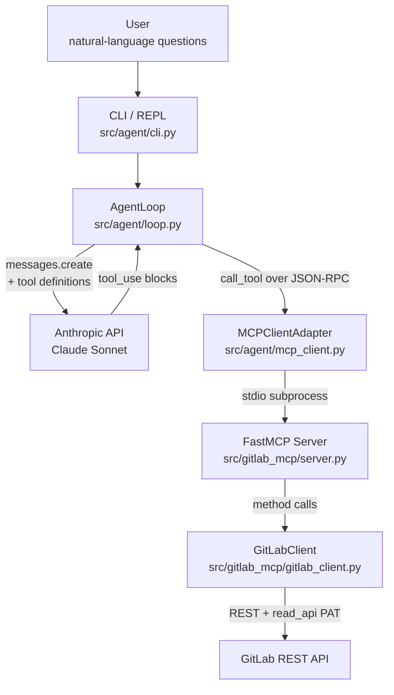

# gitlab-mcp

[](https://github.com/readyrok/gitlab-mcp/actions/workflows/ci.yml)

> A read-only [Model Context Protocol](https://modelcontextprotocol.io/) server
> exposing GitLab as five tools an AI agent can use, plus a CLI agent that
> drives it through the Anthropic API.

Built as a study project to understand MCP from both sides — the protocol's
server surface (how tools are described and executed) and its client surface
(how an agent discovers and orchestrates them). The whole stack runs locally
against your own GitLab and Anthropic credentials.

```text
> uv run agent
gitlab-mcp agent — type a question or /help
> what's open in my projects?
🤔 thinking...
  🔧 list_projects()
     ✓ {"id": 81913181, "name": "acme-order-service", ...}
  🔧 get_merge_requests(project_id=81913181, state='opened')
     ✓ {"id": 5001, "title": "WIP: async SQLAlchemy migration", ...}
  🔧 get_merge_requests(project_id=81913196, state='opened')
     ✓ {"id": 5004, "title": "Add bulk stock-update endpoint", ...}
  🔧 get_merge_requests(project_id=81913213, state='opened')
     ✓ {"id": 5006, "title": "Add dark mode toggle and theme provider", ...}

You have 4 open merge requests across your three projects:

- acme-order-service: "WIP: async SQLAlchemy migration" (draft) and
  "Add Prometheus metrics for queue depth" (ready for review)
- acme-inventory-api: "Add bulk stock-update endpoint"
- acme-web-frontend: "Add dark mode toggle and theme provider"
> _
```

## Why this exists

Modern engineering organizations are starting to deploy AI agents that act on
real systems — GitLab, Jira, internal services, CI tooling. MCP is the
emerging standard for how an agent discovers and uses such tools, and it's
the same protocol Claude Desktop, Cursor, and other production clients use.

This project demonstrates the full stack:

- A real **MCP server** exposing 5 GitLab capabilities (projects, merge
  requests, issues, pipelines, user activity), with LLM-facing tool
  descriptions tuned for accuracy.
- A real **MCP client** + agentic loop that uses the Anthropic API to drive
  the server. Streams tool calls live so you can watch the agent reason.
- The lifecycle around it: TDD on the GitLab client, server-level integration
  tests, structured logging at API boundaries, bounded pagination for LLM
  consumption, a typed exception hierarchy with single-point translation.

The detailed reasoning behind every architectural choice — and what would
change at scale — lives in [`docs/DESIGN.md`](docs/DESIGN.md).

## Architecture



Three things worth noting about the layout:

- **The agent has no GitLab knowledge.** It speaks MCP. Swap the server and it
  runs against any other MCP-compatible service.
- **The MCP server has no agent knowledge.** It exposes tools. Any
  MCP-compatible client (Claude Desktop, Cursor, your own agent) can use it.
- **The boundary between agent and server is a real subprocess speaking
  JSON-RPC over stdio.** It's not a glorified function call dressed up as a
  protocol — same transport Claude Desktop uses against MCP servers in
  production.

## Tools exposed

Each tool's full LLM-facing description lives in
[`src/gitlab_mcp/server.py`](src/gitlab_mcp/server.py); these are the
one-line summaries.

| Tool | Purpose |
|---|---|
| `list_projects` | Enumerate projects accessible to the configured user |
| `get_merge_requests` | List MRs by project and state (opened / closed / merged / locked / all) |
| `search_issues` | Find issues by free-text search within a project |
| `get_pipeline_status` | Most recent CI pipelines for a project, newest-first |
| `get_user_activity` | Aggregated summary of a user's recent commits / MRs / issues / comments |

## Quickstart

Requires Python 3.11+, [uv](https://docs.astral.sh/uv/), and a GitLab account.

```bash
# 1. Install dependencies
uv sync --all-extras

# 2. Configure
cp .env.example .env
# Edit .env: set GITLAB_TOKEN (read_api scope is enough) and ANTHROPIC_API_KEY

# 3. (Optional) Seed a demo workspace under your GitLab account
#    Creates three projects with realistic issues, MRs, and pipelines.
#    See docs/SETUP.md for full details, including the two-token security model.
uv run python scripts/seed_gitlab.py --seed

# 4. Run the agent
uv run agent                              # interactive REPL
uv run agent "what's broken in CI?"       # single-shot
uv run agent --verbose "..."              # show every tool call as it happens

# 5. Or run the MCP server directly (e.g. for Claude Desktop, Cursor, the MCP Inspector)
uv run gitlab-mcp
```

## Project layout

```
gitlab-mcp/
├── src/
│   ├── gitlab_mcp/         # the MCP server
│   │   ├── server.py         # FastMCP entry; tool registrations
│   │   ├── gitlab_client.py  # async GitLab REST client (paginated, typed errors)
│   │   ├── models.py         # Pydantic models per entity
│   │   ├── errors.py         # typed exception hierarchy
│   │   └── config.py         # pydantic-settings — single config surface
│   └── agent/              # the CLI agent
│       ├── cli.py            # REPL + single-shot mode
│       ├── loop.py           # agentic loop (Anthropic + tool dispatch)
│       └── mcp_client.py     # stdio MCP client adapter
├── tests/                  # 25 tests across unit + integration
├── scripts/seed_gitlab.py  # provisions the demo workspace
└── docs/
    ├── SETUP.md            # how the demo workspace was provisioned
    └── DESIGN.md           # architectural decisions + what would change at scale
```

## Tests

```bash
uv run pytest          # 25 tests, ~85% coverage
uv run pytest --cov    # detailed coverage report
uv run ruff check      # lint
```

The test suite is split across three files reflecting the architecture:

- `tests/test_gitlab_client.py` — unit tests for the GitLab client. TDD-driven;
  the git history shows the test→implementation→test rhythm.
- `tests/test_server.py` — integration tests for the MCP layer.
- `tests/test_agent_loop.py` — agentic loop tests with hand-rolled fakes for
  Anthropic and the MCP client.

## License

MIT.